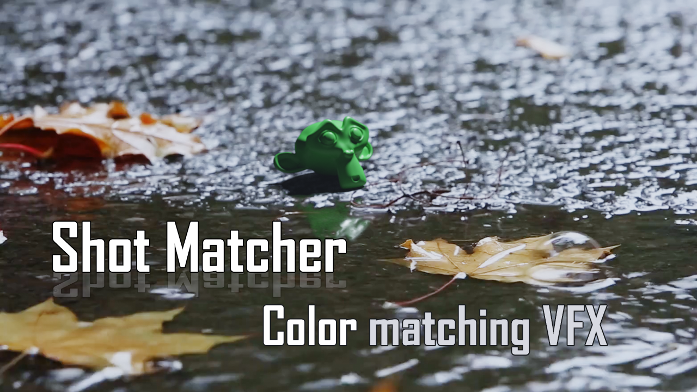

## My Official Extensions Repository

Welcome!
Here you can add my repository in Blender 4.2 to access all my free extensions.

Just add the following URL in Blender as a remote repository:

> [https://semagnum.github.io/extensions/add_ons/index.json](https://semagnum.github.io/extensions/add_ons/index.json)

If you need them offline, you can download them individually,
either from their own repositories or the zip files included in this repository.

## Includes

[Shot Matcher](https://github.com/semagnum/shot_matcher)
to simplify basic color matching for compositing visual effects

[BLint](https://github.com/semagnum/blint) for simplified project standardization and quality checks

[Color From Material](https://github.com/semagnum/Material_Color_From_Nodes)
to quickly generate viewport materials colors based on the shader nodes

[Scene Complexity](https://github.com/semagnum/blender-scene-complexity)
to analyze the complexity of your scene and make better optimization decisions

### Others I'm too lazy to make a thumbnail for

- [Copy Render Command](https://projects.blender.org/SMagnusson/copy_render_command)
  generates a command to render your current file,
  and copies it to your clipboard.
  Paste it into your favorite terminal, and enjoy command line rendering!
- [Separate with Instances](https://github.com/semagnum/separate_with_instances)
  extends the mesh separate operator to add separated pieces to other mesh instances.